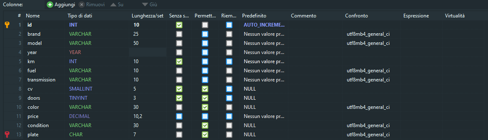

# Tabella: USED_CARS

Modellizzare la struttura di una tabella per memorizzare tutti i dati riguardanti delle auto usate messe in vendita da un concessionario 

| Campo          | Tipo           | Vincoli / Descrizione |
|----------------|----------------|------------------------|
| **ID**         | `INT`          | PRIMARY KEY, UNIQUE, NOT NULL, AUTOINCREMENT |
| **BRAND**      | `VARCHAR(25)`  | NOT NULL — Marca dell’auto |
| **MODEL**      | `VARCHAR(50)`  | NOT NULL — Modello dell’auto |
| **YEAR**       | `YEAR`         | NOT NULL — Anno di immatricolazione |
| **KM**         | `INT`          | NOT NULL — Chilometraggio |
| **FUEL**       | `VARCHAR(10)`  | NOT NULL — Tipo di carburante (benzina, diesel, ibrido, elettrico, ecc.) |
| **TRANSMISSION** | `VARCHAR(10)` | NOT NULL — Tipo di cambio (manuale, automatico, ecc.) |
| **CV**         | `VARCHAR(3)`   | NULL — Cavalli o potenza del motore |
| **DOORS**      | `TINYINT`      | NULL — Numero di porte |
| **COLOR**      | `VARCHAR(30)`  | NULL — Colore della carrozzeria |
| **PRICE**      | `DECIMAL(10,2)`| NOT NULL — Prezzo di vendita in euro |
| **CONDITION**  | `VARCHAR(30)`  | NULL — Stato dell’auto (es. Ottime condizioni, Usato garantito, ecc.) |
| **PLATE**      | `CHAR(7)`      | UNIQUE, NULL — Targa del veicolo |

---



```sql
CREATE TABLE USED_CARS (
  ID INT PRIMARY KEY AUTO_INCREMENT,
  BRAND VARCHAR(25) NOT NULL,
  MODEL VARCHAR(50) NOT NULL,
  YEAR YEAR NOT NULL,
  KM INT NOT NULL,
  FUEL VARCHAR(10) NOT NULL,
  TRANSMISSION VARCHAR(10) NOT NULL,
  CV VARCHAR(3),
  DOORS TINYINT,
  COLOR VARCHAR(30),
  PRICE DECIMAL(10,2) NOT NULL,
  CONDITION VARCHAR(30),
  PLATE CHAR(7) UNIQUE
);
